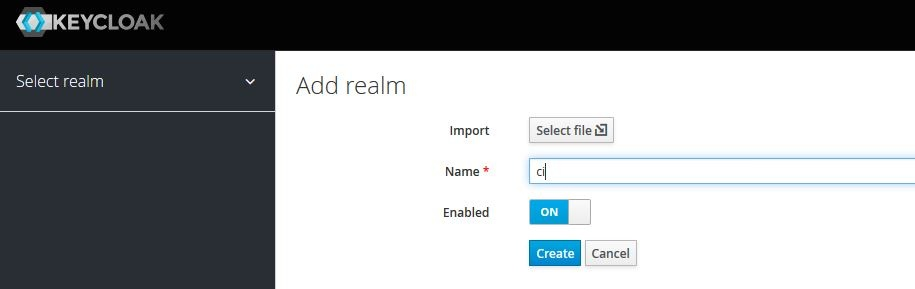
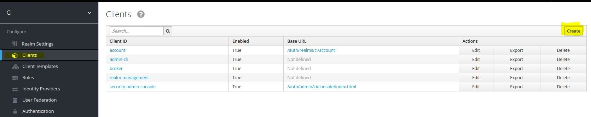
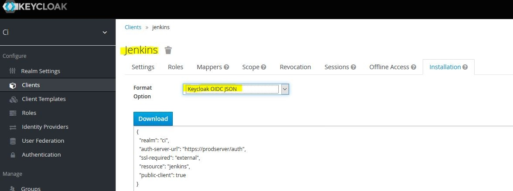
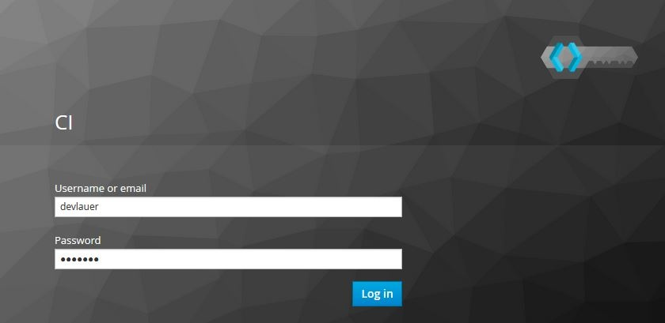

# Keycloak Plugin

About
---
This plugin incorporates SSO in [Jenkins] with [Keycloak]

Installation
---
1. Within the Jenkins dashboard, click Manage Jenkins.
2. In the Manage Jenkins page, click Manage Plugins.
3. Click the Available tab.
4. Filter for keycloak
5. Click either “Install without restart” or “Download now and install after restart”.
6. Restart Jenkins if necessary.

Usage
---

You can watch the screencast in
**[Vimeo](https://vimeo.com/116429910)****/****[YouTube](https://www.youtube.com/watch?v=_WAFuOa53R0)**** ****(You
may have to put the speaker in high volume)**

**(applies only to the older plugin version)**

**Usage of the newer version:**

#### Step 1 : Create a keycloak client in a realm

Lets call the realm **'ci'** and the client **'jenkins'**  

Jenkins is running on port **8080**

Create the client accordingly

Also make sure sample users are also created, in this case I have
created 'devlauer'.

#### Step 2 : Copy the keycloak.json

#### Step 3 : In the Jenkins global settings page paste the content

#### Step 4 : In the Security Realm activate the security realm of the plugin

#### Step 5 : Login into jenkins

User would be redirected to keycloak for authentication

#### Step 7 : Keycloak would redirect back to jenkins

User would be redirected back to callback URL

  

License
---
Jenkins-Keycloak-Plugin is **licensed** under the **[MIT License]**.

Versioning
---
This plugin uses sematic versioning. For more information refer to [semver]

Changelog
---
This plugin has a dedicated [Changelog].

Reporting bugs and feature requests
---
We use the [Jenkins JIRA] to log all bugs and feature requests. Create a [new account], browse to [Jenkins JIRA] and login with your account then create a new issue with the component `keycloak-plugin`.

Source
---
Latest and greatest source of Jenkins Keycloak Plugin can be found on [GitHub]. Fork it!

Building From Source
---
* Checkout or download the source code from the latest tag on [GitHub]
* Execute `mvn clean verify` from your local source code folder (install [Maven] if not already done).
* Find the `keycloak.hpi` file in the `target` subfolder.

Testing The Plugin
---
Execute the following

	mvn hpi:run -Djetty.port=8090 -Dhpi.prefix=/jenkins

For more details refer the [official plugin tutorial](https://wiki.jenkins-ci.org/display/JENKINS/Plugin+tutorial)

Notice
---
This repository was forked from this  [repository](https://www.github.com/devlauer/jenkins-keycloak-plugin), which was originally a fork of this [repository](https://www.github.com/keycloak/jenkins-keycloak-plugin)

[semver]: http://semver.org
[Jenkins]: http://jenkins-ci.org 
[Keycloak]: http://keycloak.jboss.org/
[new account]: https://accounts.jenkins.io/
[Jenkins JIRA]: https://issues.jenkins-ci.org/
[official plugin tutorial]: https://wiki.jenkins-ci.org/display/JENKINS/Plugin+tutorial
[MIT License]: https://github.com/jenkinsci/keycloak-plugin/raw/master/LICENSE
[Changelog]: https://github.com/jenkinsci/keycloak-plugin/blob/master/Changelog.md
[GitHub]: https://github.com/jenkinsci/keycloak-plugin
[Maven]: http://maven.apache.org
[wiki]: https://wiki.jenkins-ci.org/display/JENKINS/keycloak-plugin